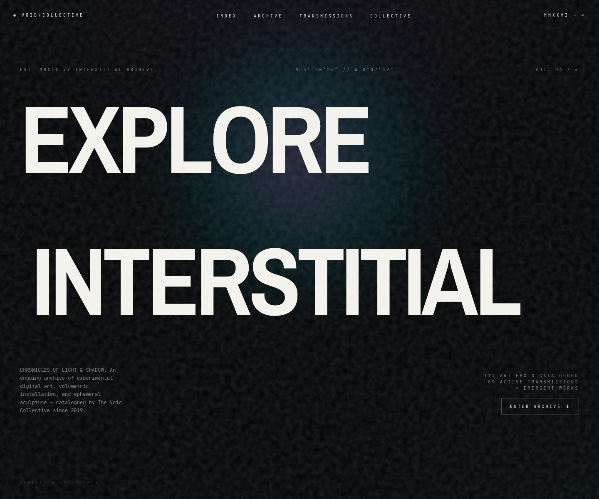
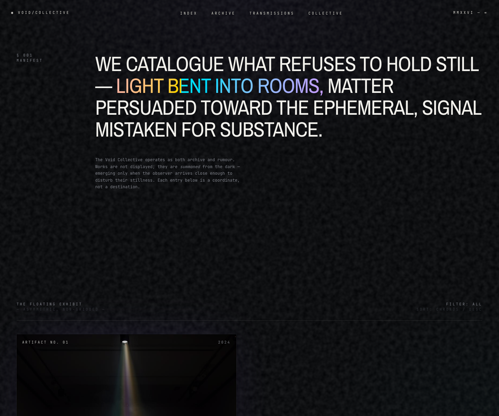
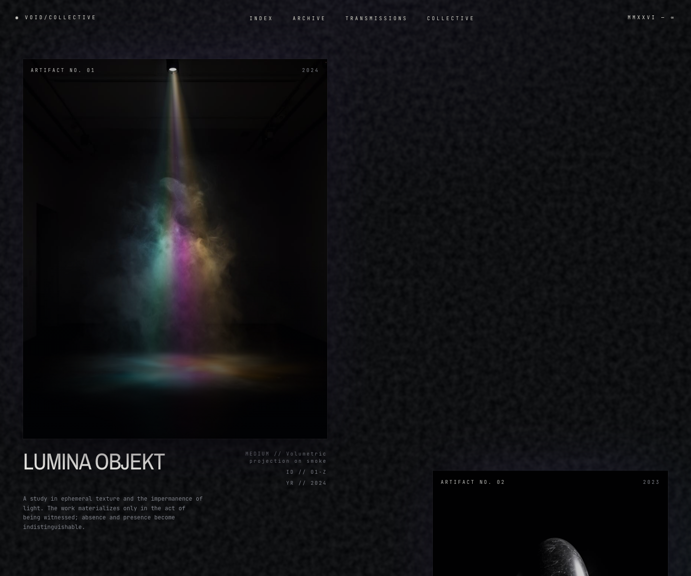

# Void Collective

Void Collective is an experimental digital art archive built with TanStack Start,
React, Tailwind CSS, and GSAP. The site presents a dark, atmospheric collection
of light installations, sculpture, and ephemeral artifacts with animated
typography, cursor-reactive image masks, magnetic navigation, parallax movement,
and scroll-driven distortion.

## Design Highlights

Screenshots captured from the rendered site in Chrome after the entrance and scroll reveal effects settle.







## Features

- File-based routing with TanStack Router and TanStack Start.
- Server-side rendering with a custom SSR error wrapper in `src/server.ts`.
- Tailwind CSS v4 theme tokens for the void, prism, mist, ash, and bone palette.
- GSAP-powered magnetic navigation and scroll-warp animation.
- IntersectionObserver reveal effects for sections and artifact entries.
- Cursor-positioned light masks over archive images.
- Reusable UI primitives in `src/components/ui`, based on Radix UI patterns.
- Local artwork assets stored in `src/assets`.

## Tech Stack

- React 19
- TanStack Start
- TanStack Router
- TanStack Query
- Vite
- Tailwind CSS v4
- GSAP
- Radix UI
- TypeScript

## Getting Started

Install dependencies:

```bash
npm install
```

Start the development server:

```bash
npm run dev
```

Vite will print the local URL, usually `http://localhost:5173`.

This repo also includes `bun.lock` and `bunfig.toml`, so Bun can be used if that
is your preferred local runtime:

```bash
bun install
bun run dev
```

## Scripts

```bash
npm run dev        # Start the local Vite dev server
npm run build      # Build the production app
npm run build:dev  # Build with development mode
npm run preview    # Preview the production build locally
npm run lint       # Run ESLint
npm run format     # Format the project with Prettier
```

## Project Structure

```text
src/
  assets/              Local artifact images
  components/
    void/              Site-specific visual components
    ui/                Shared UI primitives
  hooks/               Shared React hooks
  lib/                 Utilities, animation hooks, and error handling
  routes/              TanStack file-based routes
  routeTree.gen.ts     Generated route tree
  router.tsx           Router setup
  server.ts            SSR fetch wrapper and fallback error handling
  start.ts             TanStack Start middleware setup
  styles.css           Tailwind imports, theme tokens, and global effects
```

## Route Conventions

Routes live in `src/routes`. The current homepage is `src/routes/index.tsx`, and
the app shell is `src/routes/__root.tsx`.

`src/routeTree.gen.ts` is generated by TanStack Router. Do not edit it by hand.

## Editing The Archive

The homepage artifact data is defined in `ARTIFACTS` inside
`src/routes/index.tsx`. Each artifact entry controls its title, medium, year,
description, image, alignment, width, parallax speed, and vertical offset.

Images are imported from `src/assets` and rendered through
`src/components/void/Artifact.tsx`.

## Styling Notes

Global visual language lives in `src/styles.css`, including:

- Tailwind theme variables.
- Dark color palette tokens.
- Prism gradient text.
- Emergence reveal transitions.
- Cursor light-mask effects.
- Global textured background overlays.

Fonts are loaded in `src/routes/__root.tsx` from Google Fonts.

## Deployment

Create a production build with:

```bash
npm run build
```

Preview the built app locally with:

```bash
npm run preview
```

The build output is managed by TanStack Start, Vite, and Nitro.
